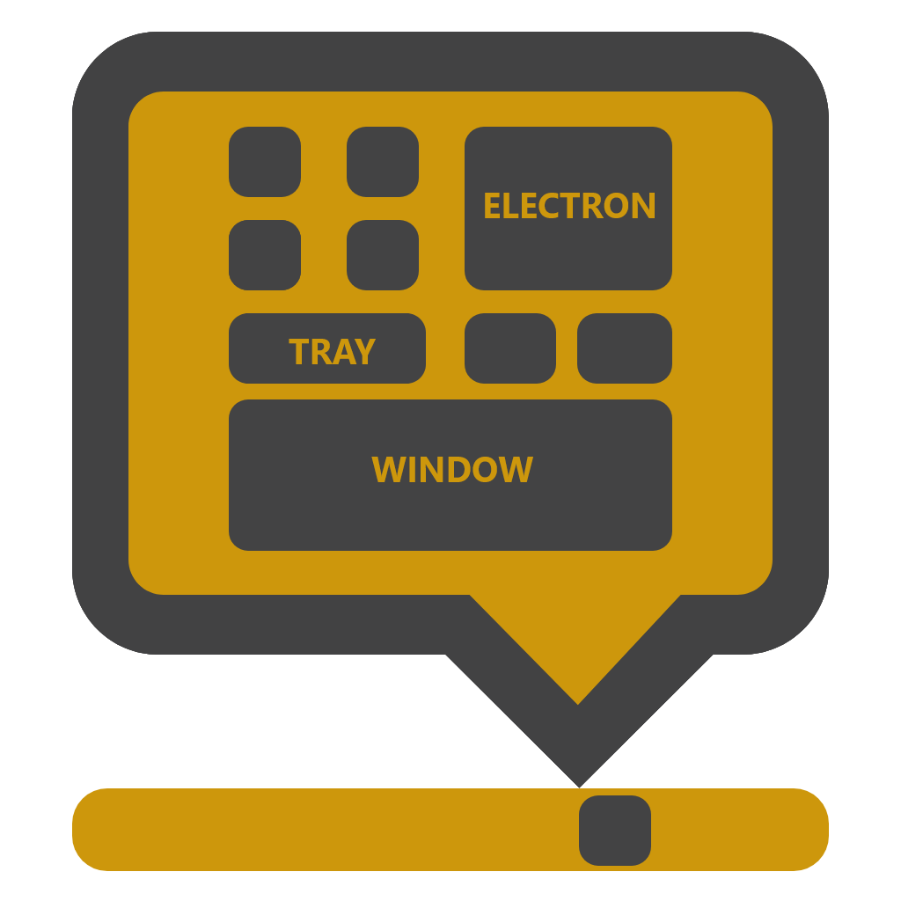

<p align="center">

</p>
<h2 align="center">Quickly create customizable  menu/pop-up for your application in system tray.</h2>

---

Electron Tray Window, basically places the window near the tray icon. While these happening, you can customize window / tray or tracking the events.

## Preview [demo project](https://github.com/sfatihk/electron-tray-window/tree/master/examples)

 

## Install

```
npm install electron-tray-window
```

or

```
yarn add electron-tray-window
```

## Usage

```js
const trayWindow = require("electron-tray-window");
```

You can use different ways. "setOptions()" function accepts object value.

If you have already created tray or window outside **TrayWindow**, you can pass as arguments to **.setOptions()** function,

```js
//...

tray = new Tray(...);
window = new BrowserWindow(...);
window.loadUrl(...);

trayWindow.setOptions({tray: tray,window: window});

//...
```

or if you pass just tray icon path or window url, it prepare automatically.

```js
//...

trayWindow.setOptions({
  trayIconPath: "...",
  windowUrl: "..."
});

//...
```

By the way you can make different combines. But object must contains;

- **tray** or **trayIconPath**
- **window** or **windowUrl**

```js

//...

tray = new Tray(...);
trayWindow.setOptions({
  tray: tray,
  windowUrl: "..."
});

//...

window = new BrowserWindow(...);

trayWindow.setOptions({
  trayIconPath: "...",
  window: window
});

//...
```

## Other Functions

You can always change **TrayWindow** with setOptions() and you can use different functions after setOptions().

## .setTray( tray )

```js
//...

trayWindow.setOptions({...});

//...

differentTray = new Tray(...);

trayWindow.setTray(differentTray); //now, follows different tray

//..
```

## .setWindow( window )

```js
//...

trayWindow.setOptions({...});

//...

differentWindow = new BrowserWindow(...);

trayWindow.setWindow(differentWindow); //now, shows different window

//..
```

## .setWindowSize( object )

```js
//...

trayWindow.setOptions({...});

//...

differentWindow = new BrowserWindow(...);

trayWindow.setWindowSize({
    width    : 200,    //optional
    height   : 300,   //optional
    margin_x : 10,  //optional
    margin_y : 10   //optional
});

//..
```

## Events

You can listen events. All event contains window and tray objects

```js
//...
const { ipcMain } = electron;

ipcMain.on("tray-window-ready", (e, a) => {
  console.log("tray window is ready");
  //console.log(e.window)
  //console.log(e.tray)
});

ipcMain.on("tray-window-clicked", (e, a) => {
  console.log("clicked the tray icon");
  //console.log(e.window)
  //console.log(e.tray)
});

ipcMain.on("tray-window-visible", (e, a) => {
  console.log("tray window is visible now");
  //console.log(e.window)
  //console.log(e.tray)
});

ipcMain.on("tray-window-hidden", (e, a) => {
  console.log("tray window is hidden now");
  //console.log(e.window)
  //console.log(e.tray)
});

//..
```

## Overview

### All parameters of setOptions()

| parameter    | description                                      | default |
| ------------ | ------------------------------------------------ | ------- |
| tray         | Electron's tray object type                      |         |
| trayIconPath | Image file path                                  |         |
| window       | Electron's BrowserWindow object type             |         |
| windowUrl    | Html etc. file path or website url               |         |
| width        | Window width                                     | 200px   |
| height       | Window height                                    | 200px   |
| margin_x     | Vertical distance between window and tray icon   | 0px     |
| margin_y     | Horizontal distance between window and tray icon | 0px     |
| framed       | Is it window framed?                             | false   |

### Other functions

| function      | description                                                       |
| ------------- | ----------------------------------------------------------------- |
| setTray       | Electron's tray object type.                                      |
| setWindow     | Electron's BrowserWindow object type                              |
| setWindowSize | Object type. Optional arguments width, height, margin_x, margin_y |

### IPC (Inter-Process Communication) Events

| event               | description              |
| ------------------- | ------------------------ |
| tray-window-ready   | when created TrayWindow. |
| tray-window-clicked | when clicked tray icon   |
| tray-window-visible | when window show up      |
| tray-window-hidden  | when window close down   |

### Default Window Properties

| properties                           | default in TrayWindow |
| ------------------------------------ | --------------------- |
| width                                | 200px                 |
| height                               | 300px                 |
| maxWidth                             | 200px                 |
| maxHeight                            | 300px                 |
| show                                 | false                 |
| frame                                | false                 |
| fullscreenable                       | false                 |
| resizable                            | false                 |
| useContentSize                       | true                  |
| transparent                          | true                  |
| alwaysOnTop                          | true                  |
| webPreferences{backgroundThrottling} | false                 |

P.S. : if you use this way `setOptions({windowUrl:"..."})`, default window values uses.
